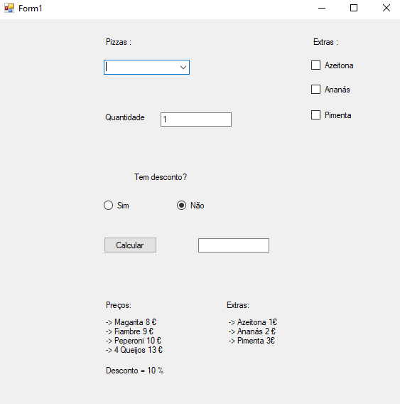

# Encomenda de Pizza – VB.NET Windows Forms

Sistema completo de encomenda de pizzas com interface gráfica.

Desenvolvido durante a formação de **Programação de Informática** – IEFP Braga (2025–2026)

### Funcionalidades
- 4 tipos de pizza (Margarita, Fiambre, Peperoni, 4 Queijos)
- Quantidade personalizável
- Extras com preço (Azeitona +1€, Ananás +2€, Pimenta +3€)
- Desconto de 10% com cartão fidelidade
- Cálculo automático e exibição do total

### Tecnologias utilizadas
- VB.NET
- Windows Forms (.NET Framework)
- Visual Studio 2022/2023

### Captura de ecrã

### Estrutura do projeto

EncomendaPizzaVbnet  
├── ExercicioGeral.sln          ← abre diretamente no Visual Studio  
├── ExercicioGeral.vbproj  
├── Form1.vb                    ← código principal  
├── Form1.Designer.vb  
├── Form1.resx  
├── App.config  
├── demo.jpg                    ← programa a correr  
└── README.md                   ← tudo explicado  

### Como executar
1. Clica no botão verde **"Code"** → **"Download ZIP"**  
2. Descompacta a pasta  
3. Dá dois cliques no ficheiro `ExercicioGeral.sln`  
4. Abre automaticamente no Visual Studio  
5. Pressiona **F5**

Feito por [Carlos Fontes](https://github.com/carlosfontesdev)  
Programador Júnior | À procura de estágio curricular 
Braga, Portugal
